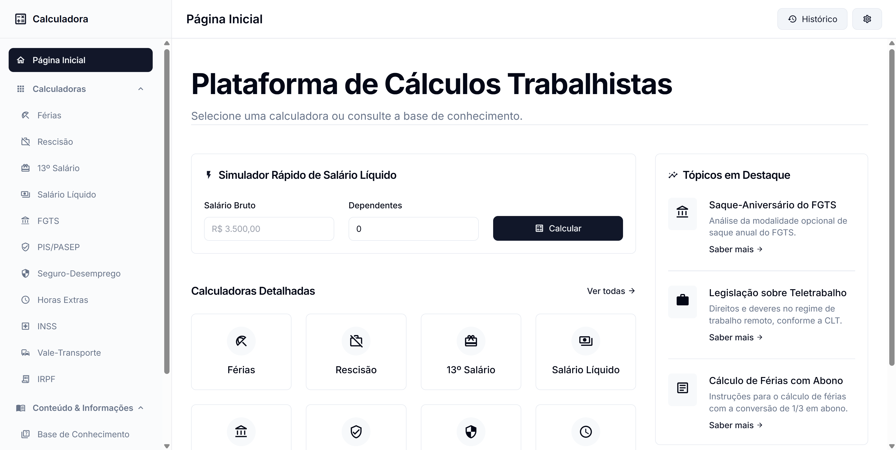

# Calculadora Trabalhista

Uma aplicação web moderna e modular para simulação de cálculos trabalhistas brasileiros. Desenvolvida com foco em clareza, transparência e manutenibilidade, esta ferramenta permite a qualquer pessoa, desde profissionais de RH a trabalhadores, calcular e entender seus direitos.



## ✨ Funcionalidades

- **Calculadoras Abrangentes:**
  - Férias (com abono e adiantamento de 13º)
  - Rescisão de Contrato (todos os principais motivos)
  - 13º Salário (primeira e segunda parcelas)
  - Salário Líquido (com adicionais e descontos)
  - E mais: FGTS, PIS/PASEP, Seguro-Desemprego, Horas Extras, INSS, Vale-Transporte e IRPF Anual.
- **Parâmetros por Ano:** Alterne facilmente entre diferentes anos (2020-2025) para comparar cálculos com base nas regras legais vigentes de cada período.
- **Interface Intuitiva:** Design limpo e responsivo construído com TailwindCSS.
- **Exportação para PDF:** Gere um resumo profissional dos seus cálculos com um único clique.
- **Base de Conhecimento:** Um FAQ integrado e um glossário para esclarecer dúvidas sobre termos e regras trabalhistas.
- **Persistência de Dados:** Suas preferências de tema e os dados inseridos podem ser salvos localmente para sua conveniência.
- **Código Aberto e Documentado:** Totalmente documentado com JSDoc para fácil entendimento e contribuição.

## 🚀 Começando

Siga estas instruções para obter uma cópia do projeto e executá-lo em sua máquina local para desenvolvimento e testes.

### Pré-requisitos

- [Node.js](https://nodejs.org/) (versão 18 ou superior)
- [npm](https://www.npmjs.com/) (geralmente instalado com o Node.js)

### Instalação

1.  Clone o repositório:
    ```sh
    git clone https://github.com/seu-usuario/calculadora-trabalhista.git
    ```
2.  Navegue até o diretório do projeto:
    ```sh
    cd calculadora-trabalhista
    ```
3.  Instale as dependências de desenvolvimento (principalmente para o TailwindCSS):
    ```sh
    npm install
    ```
4.  Compile os estilos CSS:
    ```sh
    npm run build:css
    ```
5.  Abra o arquivo `index.html` em seu navegador. Não há necessidade de um servidor web complexo.

Para desenvolvimento contínuo, você pode executar o watcher do TailwindCSS para recompilar os estilos automaticamente sempre que fizer alterações:
```sh
npm run dev:css
```

## 🛠️ Stack Técnica

- **Frontend:** HTML5, CSS3, JavaScript (ES Modules, Padrão 2022+)
- **Estilização:** [TailwindCSS](https://tailwindcss.com/) com PostCSS e Autoprefixer
- **Geração de PDF:** [jsPDF](https://github.com/parallax/jsPDF) com [jsPDF-AutoTable](https://github.com/simonbengtsson/jsPDF-AutoTable) (carregados dinamicamente via CDN)
- **Testes:** Scripts de asserção simples com Node.js

## 🏗️ Arquitetura do Projeto

O projeto segue uma arquitetura modular e desacoplada, separando claramente as responsabilidades para facilitar a manutenção e a extensibilidade.

- `src/core/`: Contém a lógica de negócio pura. Todos os módulos de cálculo, regras de negócio e acesso aos parâmetros legais estão aqui. Não possui dependências de UI.
- `src/app/`: Orquestra a aplicação, inicializando os sistemas, manipulando eventos globais e conectando a UI com a lógica de negócio.
- `src/ui/`: A camada de apresentação. Inclui componentes de UI (barra lateral, cartões de resultado) e o renderizador principal que atualiza o DOM com base no estado da aplicação.
- `src/services/`: Módulos de utilidades transversais, como formatação de moeda/datas, geração de PDF e interação com o `localStorage`.
- `src/features/`: Funcionalidades adicionais que enriquecem a experiência, como a base de conhecimento (FAQ), artigos e glossário.
- `data/`: Armazena dados estáticos, como os parâmetros legais de cada ano (tabelas de INSS, IRRF), textos, artigos e a base de conhecimento.
- `tests/`: Scripts de teste para garantir a corretude dos cálculos.

Para um mergulho mais profundo nas decisões de arquitetura, consulte nossos **[Registros de Decisão de Arquitetura (ADRs)](./docs/adr)**.

## 📚 Documentação do Código

O código-fonte é integralmente documentado utilizando o padrão **JSDoc**.

Para gerar uma documentação HTML navegável, você pode utilizar o JSDoc:
```sh
# (Opcional) Instale o JSDoc globalmente ou como uma dependência de desenvolvimento
npm install -g jsdoc

# Gere a documentação a partir da raiz do projeto
jsdoc src -r -d ./docs/jsdoc
```
Isso criará um site estático em `docs/jsdoc` com toda a documentação do projeto.

## 🤝 Como Contribuir

Contribuições são o que tornam a comunidade de código aberto um lugar incrível para aprender, inspirar e criar. Qualquer contribuição que você fizer será **muito bem-vinda**.

1.  Faça um Fork do Projeto
2.  Crie sua Feature Branch (`git checkout -b feature/FuncionalidadeIncrivel`)
3.  Faça o Commit de suas mudanças (`git commit -m 'Adiciona alguma FuncionalidadeIncrivel'`)
4.  Faça o Push para a Branch (`git push origin feature/FuncionalidadeIncrivel`)
5.  Abra um Pull Request

## 📄 Licença

Distribuído sob a Licença MIT. Veja `LICENSE` para mais informações.